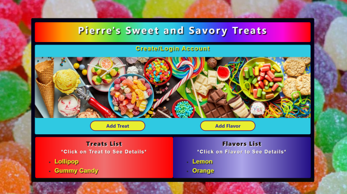

# Pierre's Sweet and Savory Treats (C# Project 5)

#### By Sue Roberts

####  MVC web application to manage their sweet and savory treats with user authentication. 

## Technologies Used

* C#
* .NET 5.0
* SQL Workbench
* Entity Framework
* ASP.Net Core Identity
* Razor
* CSS
* Bootstrap
* HTML

## Description

The application has user authentication. Users are able to login and logout. Only login users could create, update and delete. All users are able to read without login. There are many-to-many relationships between Treats and Flavors. A treat can have many flavors and a flavor can have many treats. Users are able to navigate to a splash page that lists all treats and flavors and click on an individual treat or flavor to see all the treats/flavors that belong to it.



## Setup/Installation Requirements

* Clone repository: $ git clone https://github.com/SueRtx/PierreSweetTreat.Solution.git  
* Open Vs Code: $ code .   
* Open TERMINAL in Vs Code
* Go to SavorySweets directory: $ cd SavorySweets
* Create file at root directory: $ touch "appsettings.json"
* Add following code to "appsettings.json" (Add your own password)
```
{
  "ConnectionStrings": {
      "DefaultConnection": "Server=localhost;Port=3306;database=sun_roberts;uid=root;pwd=[YOUR-PASSWORD];"
  }
}

``` 
* Download MySQL WorkBench  
* Go to terminal  → $ dotnet restore → $ dotnet build → dotnet ef database update
* Run Program: $ dotnet run  
* Open web browser: http://localhost:5000/  

## Known Bugs

* none

## License

MIT

Copyright (c) 2022 Sue Roberts
